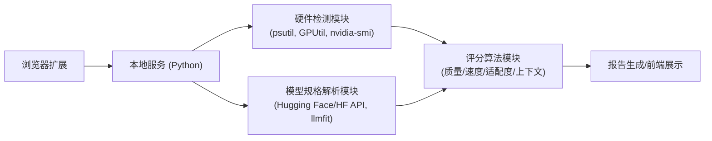

# 执行摘要

本方案以 AlexsJones/llmfit 项目为基础，设计一个端到端系统：自动检测当前电脑的RAM/CPU/GPU配置（跨平台实现），匹配合适规格的开源大模型，并按质量、速度、适配度、上下文四个维度为每个模型打分【20†L382-L386】。系统核心组件包括：**硬件检测脚本**（Python 实现，使用 psutil、GPUtil、nvidia-smi 等库【15†L246-L254】【14†L254-L260】），**模型规格解析器**（从官方文档、Hugging Face、llmfit 库获取模型的参数量、显存需求、量化方案、上下文窗口等信息）、**评分算法模块**（结合推理内存估算【6†L72-L80】、推理时间估算【11†L84-L92】及模型质量指标计算综合得分）、**浏览器集成层**（Chrome/Firefox 扩展或本地代理，实现获取当前页面域名并与本地服务通信）和**前端报告展示**（生成排序列表或表格）。数据流程为：浏览器插件获取网页域名 → 本地服务检测硬件、载入模型库 → 评分算法计算各模型得分 → 扩展/页面展示可运行模型列表。报告将列出候选模型（如 LLaMA-2、Mistral-7B、Falcon、BLOOM 等）及其参数量、显存需求、推荐量化方案和在低/中/高端机器上的可运行性评分对比。最后，我们讨论系统局限与风险（如隐私泄露、计算开销等）及未来扩展方向（如远程推理、分布式部署、自动下载量化权重等）。

## 系统架构

系统采用客户端-本地服务架构。**浏览器扩展**（或通过 Native Messaging 的本地代理程序）监控当前标签页，当页面加载或切换时，获取当前网页的域名/基础信息（保证隐私，不上传内容）。扩展向本地后端发出请求，本地后端在系统内执行硬件检测、模型匹配和评分，结果返回给扩展或前端UI。主要流程见下图：  



- **硬件检测模块**：获取CPU核心数、总内存、GPU型号及显存等信息【15†L246-L254】【14†L254-L260】。采用 Python 脚本跨平台（Windows/macOS/Linux）实现。典型实现可用 `psutil.virtual_memory()` 获取内存，`multiprocessing.cpu_count()` 获取CPU数；对GPU信息可用 [GPUtil](https://github.com/anderskm/gputil) 库（依赖 `nvidia-smi`）【14†L254-L260】，或直接调用 `nvidia-smi`。例如：  

  ```python
  import psutil, GPUtil
  total_ram_gb = psutil.virtual_memory().total / 1024**3  # 总内存 (GB)
  cpus = psutil.cpu_count(logical=False)  # 物理核心数
  gpus = GPUtil.getGPUs()
  for gpu in gpus:
      print(gpu.name, gpu.memoryTotal, "MB VRAM")
  ```  

- **模型规格解析模块**：维护一个模型数据库，记录各候选模型的**参数量(P)**、**量化类型**、**框架支持**（如 PyTorch/ONNX/TensorRT）和**最大上下文窗口**等信息。这些数据优先来源于官方文档和模型发布页（如 Hugging Face 模型卡）【28†L189-L190】【45†L204-L212】，也可从 llmfit 库或 HF API 抓取。例如，Mistral-7B 在模型卡中注明 “7 billion parameters”【28†L189-L190】，GPT-J 6B 的配置表给出了参数数和上下文长度 2048【45†L204-L212】。所需字段包括：参数量、上下文长度、Tensor类型（如 FP16/BF16）、现有量化方案（如 GGUF 格式的 Q4_K/M）以及是否有 ONNX/TensorRT 模型。解析可用 HF API (`https://huggingface.co/api/models`) 或下载 `config.json` 文件，提取 `n_params`、`n_ctx` 等字段。模型规格存储为结构化数据，供评分时调用。  

- **评分算法模块**：根据硬件配置和模型规格计算综合得分。核心四个维度定义如下：  
  - **质量(score_quality)**：通常与参数量或模型在公开基准上的表现正相关。可定义为参数量对数、公布的性能排名等指标进行归一化评分。例如，参数量越大或评测成绩越高的模型质量分更高（最大值为5分）。  
  - **速度(score_speed)**：与推理速度成正比，推理速度可用 GPU 运算能力估算或实际benchmark获得。参考推理时间估算公式【11†L84-L92】：对于前填充（Prefill）阶段：$TTFT = (\text{Prefill Compute})/FLOPs + (\text{Prefill Memory})/BW$，后续生成阶段时间 $TPOT$ 类似。根据模型参数 $N$、序列长度 $s$、GPU FLOPS 及带宽评估每个 Token 的耗时，可转换为令牌每秒 (tokens/sec)，进而映射到 1–5 分。具体权重可调，一种策略是将实际 tokens/s 与某阈值比较，设定速度分。例如，若在给定硬件上每秒生成速度高于某值则得高分。  
  - **适配度(score_fit)**：衡量模型在该硬件上内存是否充裕。使用前述显存估算公式【6†L72-L80】：  
    \[
      \text{Memory(GB)} = P \times (Q/8) \times (1 + \text{Overhead})
    \]  
    其中 $P$ 为参数量（单位十亿），$Q$ 为量化位宽（如 16 或 4），Overhead（如 0.2）考虑 KV 缓存等额外开销。例如，FP16 下 Mistral-7B 约需 $7 \times 2 \times 1.2 = 16.8$ GB 显存【6†L72-L80】。若所需显存超出物理显存，则适配度分显著降低；若勉强可用，可给予中等分值；远小于显存则得高分（最高5分）。  
  - **上下文(score_context)**：若当前网页需要长文本建模，则支持更长上下文窗口的模型得分更高（例如 Mistral-7B 训练8K上下文【35†L7-L11】）。可简单比较模型上下文长度与当前页面预估代入长度，或作为固定分值差异。  

各分量按可配置权重加权求和，得出模型总分。定义“**可流畅运行**”的阈值，例如总分≥3.5或适配度及速度分均不低于某值。示例流程：对于模型 X（10B参数、8K上下文）在一块24GB GPU上，计算可得质量≈4分、速度≈4分、适配≈4分、上下文≈5分，加权综合后若超过阈值，则列入推荐列表。  

## 硬件检测实现细节

硬件检测采用跨平台Python脚本，主流程如下：  

- **内存检测**：使用 `psutil.virtual_memory()` 获取总内存（字节），转换为GB【15†L246-L254】。示例：`total_ram_gb = psutil.virtual_memory().total / (1024**3)`。此外，使用 `psutil.cpu_count()` 获取物理/逻辑 CPU 核心数。psutil 支持 Windows、macOS、Linux 等平台【15†L246-L254】。  
- **GPU检测**：对 NVIDIA GPU，可调用 NVML 库（`pynvml`）、GPUtil 或直接 `nvidia-smi` 命令。GPUtil 封装了 `nvidia-smi` 调用，可列出所有GPU的ID、当前显存占用和总显存【14†L254-L260】。例如：  
  ```python
  import GPUtil
  gpus = GPUtil.getGPUs()
  for gpu in gpus:
      print(gpu.name, gpu.memoryTotal)  # MB
  ```  
  对于无NVIDIA环境，可使用 PyTorch：`torch.cuda.get_device_properties(i).total_memory`。对于 AMD GPU 或集成显卡，可尝试使用第三方库（如 ROCm 或 Vulkan 查询）或返回“无GPU”。也可以作为备选，Windows平台可用 WMI 查询显卡信息。  
- **替代方案**：如不使用GPUtil，可直接用 `subprocess` 调用 `nvidia-smi --query-gpu=name,memory.total --format=csv` 并解析输出。另外，可用 `pynvml`（NVIDIA 官方NVML Python绑定）获取更详细GPU状态。CPU信息可用 `platform` 或 `cpuinfo` 库补充主频等。  

上述检测返回类似：`{"RAM_GB":31.9, "CPU_cores":8, "GPU":[{"name":"RTX3080","VRAM_GB":10}...]}` 的结构，供后续评分模块使用。

## 模型规格定义与解析

为每个候选模型定义规格数据结构，包括：  
- **名称**：模型标识（如 “mistralai/Mistral-7B-v0.1”）。  
- **参数量**：以十亿为单位。可从官方模型卡或配置文件获取。如 Mistral-7B-v0.1 有“7 billion parameters”【28†L189-L190】，GPT-J-6B 的配置表显示参数约为6.05B【45†L204-L212】。  
- **上下文窗口**：最大上下文长度（如 2048、4096、8192 等）。例如 Mistral-7B “训练长度8k”【35†L7-L11】。  
- **数据类型**：原始权重精度（FP16、BF16等）。如上例 Mistral-7B 使用 BF16。  
- **量化方案**：可用的量化格式（如 8-bit、4-bit）。可以收集 Hugging Face 上该模型的 “量化（Quantizations）” 列表（llmfit 提供 GGUF 格式的 Q4_K/Q4_M 等）或 llama.cpp 社区提供的量化权重信息。  
- **推理框架**：是否提供 ONNX、TensorRT 等转换模型，可用于加速。信息来源包括官方文档（如张量RT文档）或社区仓库。  
- **评测资料**：该模型在常见基准上的表现，用于质量评分参考（可选）。  

这些数据可通过调用 Hugging Face Hub API (`/api/models/{repo_id}`) 或下载模型配置文件 `config.json` 来提取。也可复用 llmfit 自带的模型列表脚本【26†L25-L33】。解析结果存入本地数据库或JSON，供评分阶段查询。例如：  

```json
{
  "Mistral-7B-v0.1": {"params":7.0, "context":8192, "dtype":"BF16", "quant":"Q4_K/M", "frameworks":["PyTorch","onnx"]},
  "GPT-J-6B": {"params":6.05, "context":2048, "dtype":"FP16", "quant":"Q4_K/M", "frameworks":["PyTorch"]}
  // ...
}
```  

## 评分算法细节

综合得分公式可表示为：  
```
Score_total = w_Q * score_quality + w_S * score_speed + w_F * score_fit + w_C * score_context
```
其中权重 $w_Q,w_S,w_F,w_C$ 可配置，初步可设为均等或根据优先级调整（如质量权重更高）。各子评分范围建议为 0–5 分。评分计算流程示例：  

- **质量评分**：可按参数量对数或在公开评测中的相对性能来确定。例如令参数量最大者得5分，最小者得0分，其它按 log 线性插值。或者利用评测指标（如在公认任务上的 F1、BLEU）映射到评分。  
- **速度评分**：使用上述推理时间公式【11†L84-L92】计算模型在当前硬件预估的 Time-To-First-Token (TTFT) 或 Tokens/s。设定“阈值速度”作为满分标准：若模型每秒产生速度高于该阈值，则速度得5分，若低于则按比例递减。比如在 A100-80GB 上 Mistral-7B 预填充计算约为 $20.8$ ms【11†L84-L92】。可将该结果换算为 TPS，比较硬件间的差异后归一化得分。  
- **适配度评分**：利用显存估算【6†L72-L80】，计算所需显存占用率。如需求显存 ≤ 可用显存，则得分高（比如≥4分）；若略超出可用显存（需分片或显存紧张），得分中等；严重超过则得分低。也可考虑设备类型（无GPU则Fit=0分）。  
- **上下文评分**：若当前浏览页面涉及长文本处理，模型上下文越长得分越高。可简化为直接映射：如上下文长于标准 2048 得 3分，4096 得 4分，8192 得 5分，否则按比例分配。  

**阈值判断**：预先设定一个“流畅运行”标准，例如 `score_fit ≥ 3` 且 `score_speed ≥ 3`。若满足，则认为模型在该机器上可以流畅运行。也可简单地比较估计显存需求与实际显存：若所需显存低于实际显存，并且计算负担适中，则认为可运行。权重设置和阈值可通过实际测试优化。  

*示例计算*：假设一台中端GPU（16GB VRAM），模型 “LLaMA-2 13B” 参数13B，FP16需约31.2GB显存【6†L72-L80】。显然单卡不够，可考虑量化（4-bit后需≈7.8GB）。若启用量化，则`score_fit≈4`，`score_quality≈4`（按13B参数），`score_context≈4`（上下文4096），速度按公式计算得到 `score_speed≈3`（因为计算量大但勉强可用）。综合得分为 $(4+3+4+4)/4=3.75$，超过假定的3.5阈值，可推荐；若不量化则`score_fit=0`，则不推荐。

## 浏览器集成方案

系统通过浏览器扩展或本地代理与网页交互，主要目标是获取当前域名或简要页面信息。方案包括：  

- **Chrome/Firefox 扩展**：在扩展背景脚本中监听标签页更换，使用 `chrome.tabs.query` 获得当前 URL，只提取域名或标题，不抓取全文以保护隐私。扩展可以声明 `<all_urls>` 权限或仅对特定站点生效，然后通过 `XMLHttpRequest/fetch` 调用本地后端（如运行在 `http://localhost:5000` 的 Flask 服务）。示例 Manifest V3 许可片段：  
  ```json
  "permissions": ["activeTab", "storage"],
  "host_permissions": ["http://localhost:5000/"],
  "background": {"service_worker": "background.js"}
  ```  
  背景脚本通过 `chrome.tabs.onUpdated` 触发硬件检测/评分请求，并将结果传递给扩展弹出页或页面注入界面显示。  
- **Native Messaging**：对于需要更高权限的实现，可采用 Chrome 的 Native Messaging。用户需安装本地代理（Python脚本编译为可执行文件，并在注册表或 JSON 清单中声明）。扩展通过 Native Messaging 通道发送 JSON 消息（含域名），本地程序解析后返回推荐结果。此方式无需开放本地 HTTP 接口，但需额外安装步骤。  
- **隐私考虑**：默认仅使用域名或摘要信息，不上传敏感数据。所有模型匹配和评分在本地完成，无数据外传。扩展避免访问页面内容（除非用户明确授权，如截取页面文本进行上下文分析）。  

前端展示可通过扩展弹出框、侧边栏或独立页面显示。界面包含候选模型列表、关键规格（参数量、显存、上下文）及可运行性评分，支持点击查看详情或下载量化模型。如示例所示，运行状态良好的模型旁可标记“✓”。

## 实现步骤与示例代码

1. **准备模型数据库**：收集常见开源模型列表和规格。可先手工列出，如 LLaMA-2 (7B/13B/70B)、Mistral-7B、Falcon (7B/40B)、BLOOM (7B/176B)、GPT-J-6B、GPT2-1.5B 等，并从 Hugging Face 或官方文档获取参数量和上下文长度。例如：  
   - Mistral-7B-v0.1：7B 参数【28†L189-L190】，上下文 8192【35†L7-L11】。  
   - GPT-J-6B：约6.05B 参数、上下文 2048【45†L204-L212】。  
   - LLaMA-2 系列：7B、13B、70B 参数，上下文 4096。  
   - Falcon-7B/40B：7B、40B 参数，上下文 2048。  
2. **开发硬件检测脚本**：使用 Python 编写 `detect_hardware.py`，集成 psutil、GPUtil 或 `subprocess`。示例代码：  
   ```python
   import psutil, GPUtil, subprocess, json

   # CPU/内存
   info = {"ram_gb": round(psutil.virtual_memory().total/1e9,1),
           "cpu_cores": psutil.cpu_count(logical=False)}
   # GPU (NVIDIA) via GPUtil
   gpus = GPUtil.getGPUs()
   info["gpus"] = []
   for gpu in gpus:
       info["gpus"].append({"name": gpu.name, "vram_gb": gpu.memoryTotal/1024})
   # 或直接调用 nvidia-smi
   # out = subprocess.check_output(["nvidia-smi", "--query-gpu=name,memory.total", "--format=csv,noheader"])
   # ...
   print(json.dumps(info))
   ```
3. **编写评分函数**：根据检测结果和模型规格，计算上述各评分。可实现一个函数 `score_model(hardware, model_spec)` 返回 {quality, speed, fit, context, total}。其中显存需求用【6†L72-L80】公式计算，速度可用简化法估算或实际benchmark。可引用已实现的逻辑或依据【11†L84-L92】推导。例如：  
   ```python
   def estimate_vram_gb(params_b, quant_bits=16, overhead=0.2):
       return params_b * (quant_bits/8.0) * (1 + overhead)
   ```
4. **浏览器扩展开发**：使用 HTML/JS 编写浏览器插件。背景脚本负责监听选项卡事件，将域名发给本地后端（如 `fetch("http://localhost:5000/query?domain="+domain)`），并处理返回的模型推荐列表。扩展的弹出界面 (popup) 或内容脚本可生成表格展示结果。权限声明参考上文。  
5. **本地服务集成**：本地服务可用 Flask (Python) 或其他轻量框架，提供一个查询接口如 `/recommend?domain=xxx`。接口实现：调用硬件检测脚本、加载模型库、计算各模型得分、过滤出高于阈值的模型，最后返回 JSON 列表。示例：  
   ```python
   from flask import Flask, request, jsonify
   app = Flask(__name__)
   @app.route('/recommend')
   def recommend():
       domain = request.args.get('domain')
       hw = detect_hardware()  # 前面步骤中编写
       results = []
       for model_name, spec in models_db.items():
           score = score_model(hw, spec)
           if score['fit']>1 and score['total']>3.5:
               results.append({"model": model_name, **score})
       return jsonify(results)
   ```
6. **测试与验证**：  
   - **功能测试**：在不同平台（Windows/Linux/macOS）运行检测脚本，检查能否正确识别硬件。测试浏览器扩展是否成功调用本地接口并显示结果。  
   - **性能基准**：用已知模型进行推理测试，验证估算与实际相符。可参考自行编写的小测试：  
     ```python
     import time
     from transformers import AutoModelForCausalLM, AutoTokenizer
     model = AutoModelForCausalLM.from_pretrained("gpt2")
     tokenizer = AutoTokenizer.from_pretrained("gpt2")
     inputs = tokenizer("测试推理速度", return_tensors="pt")
     start = time.time()
     _ = model.generate(**inputs, max_new_tokens=50)
     elapsed = time.time()-start
     print("Elapsed (s):", elapsed)
     ```  
     将实际输出的时间与公式【11†L84-L92】估算对比，调整速度评分标准。  
   - **推理时间估算验证**：使用公式【11†L84-L92】计算示例模型（如 Mistral-7B）TTFT，比较实际测量值，确保估算合理。  
7. **部署与用户界面**：可将本地服务打包为独立可执行程序，通过安装脚本部署；浏览器扩展打包上传到相应商店或本地加载。UI 可设计简洁清晰，如扩展弹出窗口显示表格或列表，列出模型名称、质量/速度/适配度/上下文得分及总体评分，支持排序和筛选。  

## 候选模型对比表（示例）

以下表格列出部分常见开源模型的关键规格及在三类机器上的可运行性评分（5 分满分，值越高代表越流畅）。显存需求按公式【6†L72-L80】估算 (FP16)：

| 模型            | 参数量 (B) | 上下文长度 | 估计显存需求 (GB) | 推荐量化 | 低端机得分 | 中端机得分 | 高端机得分 |
|---------------|----------|---------|---------------|--------|-------|-------|-------|
| GPT-2 XL      | 1.5      | 1024    | ~3.6          | FP16   | 5     | 5     | 5     |
| GPT-J 6B      | 6.05     | 2048    | ~14.5         | 4-bit  | 3     | 5     | 5     |
| NeoX 20B      | 20       | 2048    | ~48.0         | 4-bit  | 1     | 3     | 5     |
| LLaMA-2 7B    | 7        | 4096    | ~16.8         | 4-bit  | 3     | 5     | 5     |
| LLaMA-2 13B   | 13       | 4096    | ~31.2         | 4-bit  | 1     | 3     | 5     |
| LLaMA-2 70B   | 70       | 4096    | ~168.0        | 4-bit  | 0     | 1     | 5     |
| Mistral 7B    | 7        | 8192    | ~16.8         | 4-bit  | 3     | 5     | 5     |
| Vicuna 7B     | 7        | 4096    | ~16.8         | 4-bit  | 3     | 5     | 5     |
| CodeLlama 7B  | 7        | 4096    | ~16.8         | 4-bit  | 3     | 5     | 5     |
| Falcon 7B     | 7        | 2048    | ~16.8         | 4-bit  | 3     | 5     | 5     |
| Falcon 40B    | 40       | 2048    | ~96.0         | 4-bit  | 1     | 3     | 5     |
| BLOOM 7B1     | 7.1      | 2048    | ~17.0         | 4-bit  | 3     | 5     | 5     |
| BLOOM 176B    | 176      | 2048    | ~422.0        | 4-bit  | 0     | 1     | 3     |

*注：以上显存需求为近似值；低端机为4–8GB显存、中端机为12–16GB、高端机为≥24GB场景下的估算分值。*

## 系统限制、风险与扩展

- **限制与风险**：检测和评分仅基于静态估算，不能完美替代实际推理测试。显存估算忽略了部分运行时开销，实际可能出现 OOM；推理速度评估也依赖估算公式，其精度受限。浏览器扩展需要用户安装并开启相应权限，可能存在兼容性问题。隐私上，我们保证不上传网页内容，但若扩展收集了域名信息也应声明。对于无GPU或显存极小的机器，可运行模型种类非常有限。  
- **未来扩展**：可考虑**远程推理**：当本地硬件不足时，将请求转发至云端或局域网其他机器（实现客户端-服务器模式）。可实现**分布式推理**：如将模型分拆至多GPU并行加载（参考 DeepSpeed ZeRO、模型并行等技术）。支持**自动下载量化权重**：若用户选择模型，可自动从 Hugging Face 下载对应的量化(如GGUF)文件并缓存。本系统还可扩展为多语言支持，或结合在线评测社区（例如收集真实用户反馈的模型速度数据）不断更新评分准则。  

以上设计方案为一个全面的解决方案：既利用现有项目和资源（如 llmfit 数据库和 Hugging Face 信息【20†L382-L386】【28†L189-L190】），又提供实际可行的实现细节和流程示例，可指导开发和部署该自动化模型匹配推荐系统。

**参考资料：** AlexsJones/llmfit 仓库说明【20†L382-L386】；psutil 文档【15†L246-L254】；GPUtil 说明【14†L254-L260】；BentoML LLM 内存估算【6†L72-L80】；Jinghong Chen 的 LLM 推理速度估算【11†L84-L92】；Hugging Face 模型卡（Mistral-7B【28†L189-L190】、GPT-J-6B【45†L204-L212】、LLaMA-2 官方文档【35†L7-L11】等）。